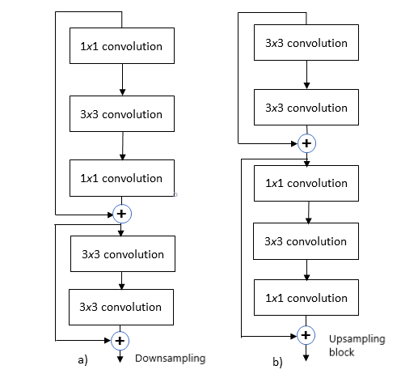
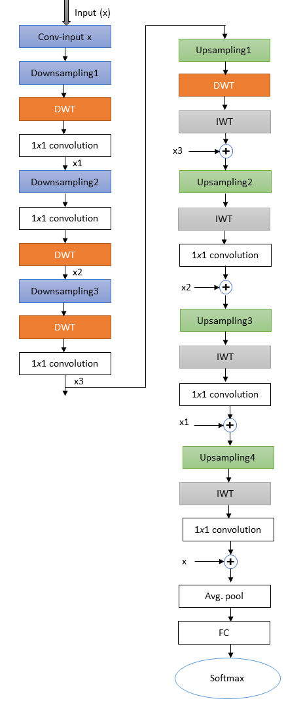

This is the PyTorch implementation of SmRNet: Scalable Multiresolution Feature Extraction Network. The network is a versatile backbone for various computer vision tasks such as detection, classification, and tracking.




If you find this work useful, please cite:


```bash
@INPROCEEDINGS{alaba2023smrnet,
  title={SmRNet: Scalable Multiresolution Feature Extraction Network},
  author={Alaba, Simegnew Yihunie and Ball, John E},
  booktitle={IEEE International Conference on Electrical, Computer and Energy Technologies (ICECET 2023)},
  year={2023},
  publisher={IEEE}
}
```
## Getting Started
#### 1. Clone code

```bash
git clone https://github.com/Simeon340703/SmRNet.git
```
#### 2. Install Python packages
Install PyTorch and related.
#### 3. How to Run
#The default batch size is 128. model choices=['SmRNet_l', 'SmRNet_m', 'SmRNet_s']. dataset choices=['cifar10', 'cifar100'],

python main.py --batch-size 128 --lr 0.1 --model SmRNet_s --dataset cifar100 --epochs 100
#### 4 To DO
1. Add Object Detection
2.  Add Semantic Segmentation
